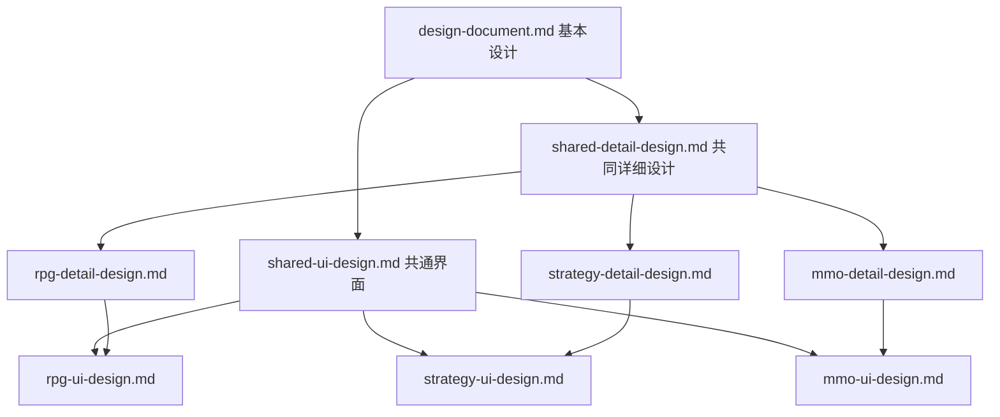

# SengokuScroll（战国绘卷）设计文档索引

最新实现与验证：[多人可靠性与情报修复（2026-09-05）](multiplayer-reliability-2026-09-05.md)。

> 版本：1.5 | 日期：2026-07-21

本目录包含项目的全部基本设计与详细设计文档。本文档为**总索引**，说明文档体系、阅读顺序、数据来源及实现对照。

此索引保留原设计阶段描述。最新实装与剩余风险请优先查看 [项目 README](../README.md)、[玩家手册](../MANUAL.md) 和 [第二轮项目复审](project-review-followup-2026-09-05.md)，不要把下方规划阶段当作当前版本状态。

---

## 1. 项目概要

| 项 | 内容 |
|----|------|
| 名称 | SengokuScroll（战国绘卷） |
| 类型 | 多模式游戏引擎（共享领域模型 + 三种玩法） |
| 背景 | 日本战国时代 |
| 目标平台 | **PC 浏览器、平板**（大屏设备；非手机优先） |
| 后端 | .NET 10 / ASP.NET Core / SignalR |
| 前端 | Vue 3 + TypeScript + Vite（地图层规划 PixiJS） |
| **开发顺序** | **策略单机 → RPG → 策略联机 → MMO** |
| **当前阶段** | **策略模式 M4**（经济重构 M4-a/b 已实装，M4-c 进行中） |

### 1.1 三种游戏模式

| 模式 | 参照作品 | 人数 | 详细设计 | 界面设计 |
|------|----------|------|----------|----------|
| 立志传（RPG） | 太阁立志传5 | 1 | [rpg-detail-design.md](./rpg-detail-design.md) | [rpg-ui-design.md](./rpg-ui-design.md) |
| 大战略（策略） | 信长之野望·革新 | 1–8 | [strategy-detail-design.md](./strategy-detail-design.md) | [strategy-ui-design.md](./strategy-ui-design.md) |
| | | | [strategy-development-plan.md](./strategy-development-plan.md)（**开发计划·待确认**） | |
| MMO | 三国群英传 Online | 数百 | [mmo-detail-design.md](./mmo-detail-design.md) | [mmo-ui-design.md](./mmo-ui-design.md) |

---

## 2. 文档体系

```
docs/
├── README.md                      ← 本文档（总索引）
├── design-document.md             ← 基本设计（架构总览、原则、技术栈）
├── game-concepts.md               ← 【维护】游戏概念词典（名词/枚举/实装对照）
├── strategy-development-plan.md   ← 【当前】策略模式开发计划（待确认）
│
├── shared-detail-design.md        ← 共同详细设计（领域、规则、网络、存档）
├── rpg-detail-design.md           ← 立志传模式详细设计
├── strategy-detail-design.md      ← 大战略模式详细设计
└── mmo-detail-design.md           ← MMO模式详细设计
│
├── shared-ui-design.md            ← 共通界面设计
├── rpg-ui-design.md               ← 立志传模式界面设计
├── strategy-ui-design.md          ← 大战略模式界面设计
└── mmo-ui-design.md               ← MMO模式界面设计
```

### 2.1 文档分层说明

| 层级 | 文档 | 职责 |
|------|------|------|
| **基本设计** | [design-document.md](./design-document.md) | 项目定位、设计原则、三模式对比、解决方案结构、技术栈、重构计划 |
| **游戏概念词典** | [game-concepts.md](./game-concepts.md) | 概念词典；§1.3.1 看法/影响/任务、§3.7 迷雾/谍报（2026-07-22 v1.7） |
| **共同详细设计** | [shared-detail-design.md](./shared-detail-design.md) | 三模式共享的领域模型、规则、时间、事件、指令、网络、存档 |
| **模式详细设计** | `*-detail-design.md` | 各模式专属 System、玩法循环、模式特有机制 |
| **开发计划** | [strategy-development-plan.md](./strategy-development-plan.md) | 里程碑、范围、确认清单（策略·草案） |
| **模式界面设计** | `*-ui-design.md` | 各模式专属画面、布局、Popup、情报系统 |

### 2.2 文档依赖关系



---

## 3. 各文档内容摘要

### 3.1 [design-document.md](./design-document.md) — 基本设计

**版本 2.2** | 必读入口

| 章节 | 内容 |
|------|------|
| §1 项目概述 | 核心定位、设计原则、**玩家体验方针**、**开发顺序**、技术栈、目标平台 |
| §2 三模式架构 | 目标项目结构、模式切换、对比矩阵、时间配置、依赖关系 |
| §3–§4 附录 | 已知 Bug、重构计划、实现进度对照 |

---

### 3.0 [game-concepts.md](./game-concepts.md) — 游戏概念词典

**版本 1.6** | 开发与策划的**概念权威清单**

| 章节 | 内容 |
|------|------|
| §0 | **维护约定** — 何时更新、变更影响检查清单 |
| §1–§11 | 策略模式已实装/设计中的全部概念（实体、战斗、经济、外交、驻军、占城、信使等） |
| 附录 A–C | 枚举速查、Rules/Systems 索引、文档交叉引用 |

> 变更 Domain/Strategy/剧本/存档/前端游戏术语时，须同步更新本文档。Cursor 规则：`.cursor/rules/game-concepts-maintenance.mdc`

### 3.0a [strategy-development-plan.md](./strategy-development-plan.md) — 策略模式开发计划（当前）

**版本 0.3** | 实装前必读

| 章节 | 内容 |
|------|------|
| §1 | 开发顺序；**§1.4 后端→前端逐步确认** |
| §2 | 玩家体验方针（**运输队实体**、**信使制度**、战斗模式选择） |
| §3 | M3 单机可玩定义 |
| §4 | 里程碑 M0–M5 |
| §5 | 首版 / 延后 / 不做 |
| §9 | **确认清单**（确认后启动实装） |

### 3.2 [shared-detail-design.md](./shared-detail-design.md) — 共同详细设计

**版本 1.0** | 后端与共享逻辑的核心参考

| 章节 | 内容 |
|------|------|
| §1 共享领域模型 | 数据定义（来自 xlsx）、实体继承、Character/Unit/Stronghold/Force 字段 |
| §2 共享规则体系 | Rules 层架构、Evaluator 体系（含三模式扩展点） |
| §3 GameDate | 时段/天/月/年推演 |
| §4 事件与数据流 | 领域事件列表、Command → Engine → Event 流程 |
| §5 指令系统 | 角色移动、单位移动、单位攻击的处理与执行流程 |
| §6 时间推进逻辑 | 各 System 优先级（气候→经济→单位→角色→AI）及属性变更 |
| §7 战术地图战斗 | 占位；详见 RPG/MMO 模式文档 |
| §8 网络与多人 | 策略 Lockstep 协议、MMO 协议、同步策略 |
| §9 存档系统 | RPG/策略/MMO 三种持久化方式 |

---

### 3.3 [rpg-detail-design.md](./rpg-detail-design.md) — 立志传模式详细设计

| 章节 | 内容 |
|------|------|
| §0 与策略关系 | **策略基础上的增量**：时间推进、城内场景、剧情演出 |
| §1 核心体验 | 单角色人生模拟、职业、成长 |
| §2 系统架构 | RpgGameEngine 及 Character/Time/Event/Growth/AI 系统 |
| §3 角色行动体系 | 移动、交互、修炼、任务、战斗类行动 |
| §4 随从系统 | 招募、管理、战斗、成长 |
| §5 游戏循环 | 实时+暂停、DayPhase 推进、AP 系统 |
| §6 职业系统 | 武士/忍者/商人/剑豪/茶人等 |
| §7 RPG 专属事件 | Quest、Skill、Relationship、Random |
| §8 RPG 专属 UI | 指向 [rpg-ui-design.md](./rpg-ui-design.md) |

---

### 3.4 [strategy-detail-design.md](./strategy-detail-design.md) — 大战略模式详细设计

| 章节 | 内容 |
|------|------|
| §1 核心体验 | EU4 式半回合、势力控制、多人联机 |
| §2 系统架构 | 气候/经济/军事/外交/角色/AI/补给系统 |
| §3 半回合制时间 | 暂停/继续、速度、多人同步 |
| §4 经济系统 | 收入、支出、资源类型 |
| §5 军事系统 | 招募、ZOC、补给线、战斗 |
| §6 自动战斗系统 | 方针驱动、瞬间事件、多人不阻塞 |
| §7 方针系统 | Directive 预设响应 |
| §8 胜率预测 | 战前预览 |
| §9 自动战斗结算 | 确定性结算流程 |
| §10 外交系统 | 宣战、和谈、同盟、战争分数 |
| §11 多人联机架构 | 主机-客机、指令同步 |
| §12 策略专属事件 | War、Peace、Alliance、InstantEvent 等 |

---

### 3.5 [mmo-detail-design.md](./mmo-detail-design.md) — MMO 模式详细设计

| 章节 | 内容 |
|------|------|
| §1 核心体验 | 日常 RPG + 定时国战 |
| §2 系统架构 | Character/Economy/Social/NationalWar/Territory/AI/Persistence |
| §3 国战系统 | 排期、单位分配、结算、世界影响 |
| §4 日常 RPG | 与 RPG 共享部分 + MMO 特有（副本/PvP/市场） |
| §5 服务器架构 | World / Zone / Battle / Database 拆分 |
| §6 MMO 专属事件 | NationalWar、PlayerJoinedForce 等 |

---

### 3.6 [shared-ui-design.md](./shared-ui-design.md) — 共通界面设计

**版本 2.2** | 所有模式共享的 UI 规范

| 章节 | 内容 |
|------|------|
| §1 设计原则 | 决策优先、运输队后勤、信使制度、间接指挥、战斗模式选择 |
| §2 画面导航 | 主菜单 → 剧本/存档 → 主地图 |
| §3–§5 | 主菜单、存档、剧本选择画面 |
| §6 势力选择 | 大战略模式势力选择 |
| §7 交互分层 | 鼠标悬停/触屏双次点击、地图拖拽缩放 |
| §8 系统菜单 | 存档、设置、返回、退出 |
| §9 响应式断点 | PC（≥1200px）、平板（768–1199px）；小屏规则供平板竖屏参考 |
| §10 操作速查表 | 鼠标与触屏对照 |

---

### 3.7 [rpg-ui-design.md](./rpg-ui-design.md) — 立志传界面设计

| 章节 | 内容 |
|------|------|
| §1 角色选择 | 表格选角、响应式侧栏 |
| §2 RPG 主地图差异 | 局部视角、无势力概要、[地图][系统] |
| §3 角色面板 | 能力、技能、关系 |
| §4 设施交互 | 据店内设施 |
| §5 RPG 战斗触发 | 进入战术地图 |

---

### 3.8 [strategy-ui-design.md](./strategy-ui-design.md) — 大战略界面设计

**版本 6.0** | 内容最丰富的 UI 文档

| 章节 | 内容 |
|------|------|
| §1 势力选择 | （见共通文档 §6） |
| §2 主地图 | 时间控制、势力概要、事件通知、小地图 |
| §3 地图弹出窗口 | 中等尺寸战略地图 |
| §4 Popup 菜单 | 上下文指令入口 |
| §5–§7 | 据点/单位/角色情报悬浮与详情 |
| §8 指令系统 | 两层菜单结构 |
| §9 情报系统 | 势力/据点/角色/经济情报 |
| §10 方针设定 | Directive 配置界面 |
| §11 瞬间事件 | 预览、自动结算、单人战术可选 |
| §12 战报 | 战斗结果展示 |
| §13 信使系统 | 延迟信息传递 UI |

---

### 3.9 [mmo-ui-design.md](./mmo-ui-design.md) — MMO 界面设计

| 章节 | 内容 |
|------|------|
| §1 多人大厅 | 服务器选择、角色列表 |
| §2 MMO 主地图 | 与 RPG 差异、多人信息 |
| §3 国战界面 | 参战、单位分配、战术指挥 |
| §4 日常 RPG | 任务、市场、势力任务 |
| §5 MMO 社交 | 好友、师徒、频道 |

---

## 4. 推荐阅读顺序

### 4.1 新人通读

1. [design-document.md](./design-document.md) — 建立全局认识
2. [shared-detail-design.md](./shared-detail-design.md) §1–§6 — 理解共享内核
3. [shared-ui-design.md](./shared-ui-design.md) — 理解 UI 原则与导航
4. 按兴趣选读某一模式的 `*-detail-design.md` + `*-ui-design.md`

### 4.2 按角色

| 角色 | 阅读路径 |
|------|----------|
| 后端 / 领域 | 基本设计 → **游戏概念词典** → 共同详细设计 → 目标模式详细设计 |
| 前端 / UI | 基本设计 §1 → 共通界面 → 目标模式界面设计 |
| 联机 / 网络 | 共同详细设计 §8 → 策略 §11 / MMO §5 |
| 策划 / 数值 | 共同详细设计 §1.0（数据定义）+ 根目录 xlsx 源表 |

---

## 5. 数据来源（根目录 Excel）

| 文件 | 用途 | 反映在设计文档 |
|------|------|----------------|
| [data.xlsx](../data.xlsx) | 游戏数据、指令表、任务表 | shared-detail-design §1.0 |
| [model.xlsx](../model.xlsx) | 实体模型定义 | shared-detail-design §1 |
| [rule.xlsx](../rule.xlsx) | 规则配置 | shared-detail-design §2、§6.3 |
| [screen.xlsx](../screen.xlsx) | 画面/界面定义 | 各 ui-design 文档 |

> Excel 为策划源表；实现时应通过构建脚本生成 C# 强类型定义与客户端 JSON。

---

## 6. 设计与代码对照

### 6.1 目标解决方案结构（设计）

见 [design-document.md §2.1](./design-document.md#21-项目结构) — 含 `Modes/`、`Combat/` 等尚未创建的项目。

### 6.2 当前已实现（2026-07-17）

| 项目 | 状态 | 说明 |
|------|------|------|
| SengokuScroll.Common | ✅ | 通用工具 |
| SengokuScroll.Domain | 🟡 | 实体、移动、路径、外交骨架 |
| SengokuScroll.Application | 🟡 | GameLoop、Command、事件分发 |
| SengokuScroll.Strategy | 🟡 | 时间/单位/战斗/经济/后勤/信使/AI/存档 |
| SengokuScroll.WebApi | 🟡 | 策略 REST API（load/advance/move/battle/save） |
| SengokuScroll.WebClient | 🟡 | Vue3 + PixiJS 策略主地图；overlay 消息/情报/通知；视口裁切 |
| SengokuScroll.Strategy.Tests | 🟡 | 策略集成测试（180+） |
| SengokuScroll.Rpg / .Mmo / .Combat | ❌ | 未创建 |
| SignalR / 多人 / MMO | ❌ | 仅设计 |

策略 UI 纵切对照见 [strategy-ui-design.md §2.4](./strategy-ui-design.md#24-m3-b-纵切实装布局webclient--mini_kanto)（布局）与 [§2.5](./strategy-ui-design.md#25-地图视口裁切strategymapcanvas--m3-d)（视口裁切）。

### 6.3 开发阶段建议

| 阶段 | 目标 | 主要文档 | 状态 |
|------|------|----------|------|
| **Phase 1** | **策略单机可玩（M3）** | [strategy-development-plan](./strategy-development-plan.md)、strategy-* | **M3-d 收尾** |
| Phase 2 | RPG（策略基础上增量） | rpg-*、rpg-development-plan（待编写） | 未开始 |
| Phase 3 | 策略多人联机 | strategy-detail §11、shared-detail §8 | 未开始 · **RPG 后** |
| Phase 4 | MMO | mmo-*、shared-detail §8.2–§8.3 | 未开始 |

---

## 7. 核心设计原则速查

1. **共享实体，独立行为** — Domain 共用，各模式独立 System / Evaluator / Action
2. **可配置时间尺度** — GameDate 支持不同粒度推演
3. **战斗模式分离** — RPG/MMO 战术地图；策略单人可选战术或自动；多人仅自动
4. **事件驱动** — 回放、存档、网络同步的基础
5. **指令与情报分离** — UI 层不混杂操作与信息（见 shared-ui-design §1）
6. **大屏优先** — PC + 平板浏览器；可选 Tauri 桌面壳
7. **决策优先** — 运输队/信使自动派遣（地图可见实体）；见 [strategy-development-plan §2](./strategy-development-plan.md#2-玩家体验方针全局)

---

## 8. 文档变更记录

| 日期 | 版本 | 变更摘要 |
|------|------|----------|
| 2026-07-21 | 1.5 | 索引同步 game-concepts v1.6（迷雾/谍报、日推进链、业务注释规范） |
| 2026-07-17 | 1.4 | 道路/区域数据模型与视口裁切文档同步；`mini_kanto` 20×20；移除 `politicalRegionGrid` 表述 |
| 2026-07-15 | — | 冻结同格堆叠/战场/战争规格写入 [game-concepts.md](./game-concepts.md) v1.3、[strategy-detail-design.md](./strategy-detail-design.md) §5.1/§10 |
| 2026-07-13 | 1.4 | 新增 [game-concepts.md](./game-concepts.md) 游戏概念词典 |
| 2026-07-09 | 1.3 | 策略 M3-d：地图地标/区域、底栏与 overlay UI |
| 2026-07-09 | 1.2 | 更新实现对照；策略 M3-d 进行中 |
| 2026-06-28 | 1.2 | 联机延后至 RPG 后；明确 RPG 为策略增量 |
| 2026-06-28 | 1.1 | 新增策略开发计划；开发顺序改为策略优先 |
| 2026-06-19 | — | 初始 9 篇设计文档 |

---

> 从 [strategy-development-plan.md](./strategy-development-plan.md)（策略 M3-d）或 [design-document.md](./design-document.md) 开始阅读。
